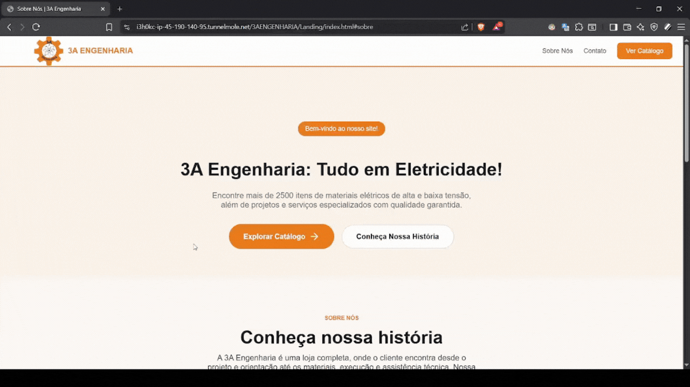
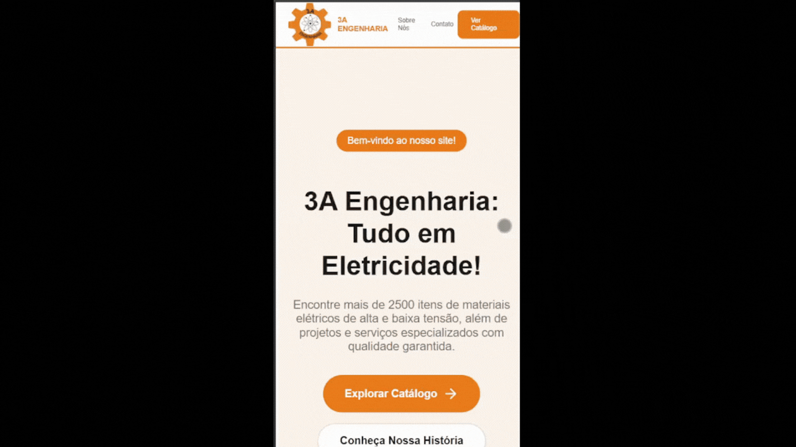
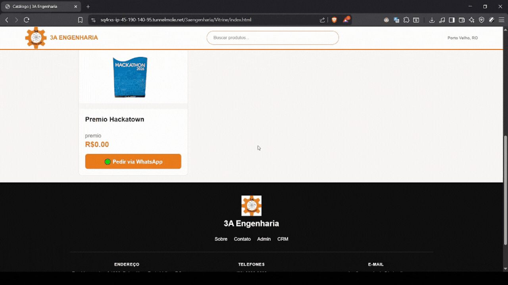
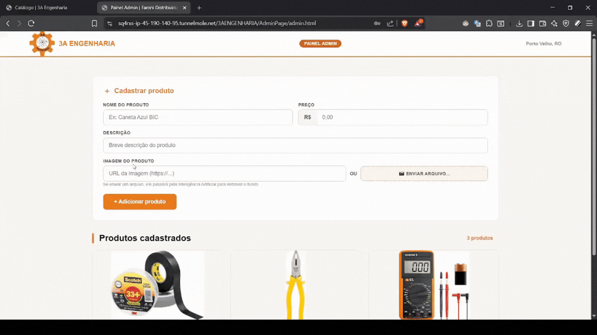
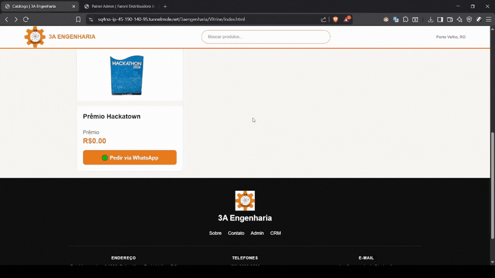

# 🏆 Hackatown 2026 - 1st Place Winning Project

Este repositório contém o projeto vencedor do **1º lugar no Hackatown 2026**! 🥇

O objetivo do hackathon foi desenvolver um sistema completo de e-commerce(landingPage, vitrine e chatbot). Nossa equipe criou uma solução robusta contendo uma **Landing Page**, **Vitrine de Produtos**, **Admin Page** e um **Chatbot de WhatsApp** integrado a um painel de atendimento (CRM), além de todas as páginas estarem responsivas.

---

## 📸 Demonstração do Projeto

Os GIFs abaixo demonstram o fluxo completo da plataforma.

### 🛍️ Visão do Cliente (Customer View)

**Versão Desktop**
<br>


**Versão Mobile**
<br>


---

### ⚙️ Visão da Empresa (Company View)

**Dashboard de Administração (Gerenciamento do BD)**
<br>


**Adição de Produtos com Remoção Automática de Fundo (IA)**
<br>


**Painel de Atendimento (CRM via WhatsApp)**
<br>


---

## ✨ Funcionalidades (Conteúdo do Template)

* **Landing Page**: Página institucional sobre a empresa.
* **Vitrines**: Exibição dos produtos da empresa.
* **Painel de Atendimento (CRM)**: Interface web para gerenciar o atendimento via WhatsApp.
* **Bot de WhatsApp**: Desenvolvido com `whatsapp-web.js` para automação e interação com clientes.
* **Admin Dashboard (HTML/CSS/JS)**: Gerenciamento do banco de dados e subdomínios.
* **API PHP**: Exemplo de integração em `htdocs/`.
* **Tema Global Responsivo**: Customizável por marca/empresa.
* **Exposição Local**: Integração com Tunnelmole (`TmoleQRcode.js`) para expor o localhost na internet facilmente durante testes.

---

## 📂 Estrutura do Projeto

| Pasta | Descrição |
|--------|-----------|
| `Faroni/` | Marca exemplo contendo `Landing/`, `Vitrine/`, `AdminPage/`, `LoginAdmin/`, e `theme.css`. |
| `3AENGENHARIA/` | Segunda marca exemplo (landing + vitrine + `theme.css`). |
| `assets/` | Imagens e arquivos estáticos compartilhados (ex.: logos referenciados como `../../assets/...`). |
| `painel-atendimento/` | Painel web do atendente (consome a API do `bot-wpp`). |
| `bot-wpp/` | Bot de WhatsApp (Node.js + Express + `whatsapp-web.js`). |
| `htdocs/projeto_01_hackatown/` | API PHP de exemplo (login, produtos). |
| `theme.css` | CSS global opcional na raiz (cada marca pode ter o seu em `Marca/theme.css`). |
| `.run/` | Configurações de execução para **JetBrains** (WebStorm). |
| `.vscode/` | Configurações para **VS Code** e Live Server. |

---

## 🚀 Como Executar o Projeto

### Pré-requisitos
- **Node.js** 18+ (recomendado LTS)
- **npm**
- **XAMPP** (ou similar) + **MySQL** (para a API PHP e banco de dados do bot)
- **Schema DB**: Execute o script em `./bot-wpp/sql/schema_atendimento.sql` no seu MySQL.

### 1. Instalação de Dependências

Na raiz do repositório, instale as dependências gerais:
```bash
npm install
```

Em seguida, instale as dependências específicas do Bot de WhatsApp:
```bash
cd bot-wpp
npm install
cd ..
```

### 2. Rodando a Aplicação (Recomendado)

Para fazer tudo funcionar de forma integrada (Front-end + Bot):

1. **Inicie o Bot de WhatsApp:**
   Abra um terminal, navegue até a pasta do bot e inicie:
   ```bash
   cd bot-wpp
   node index.js
   ```
2. **Inicie o Front-end (Vite):**
   Após o bot indicar que está online, abra **outro terminal** na raiz do projeto e rode:
   ```bash
   npm run dev
   ```
3. **Acesso Externo (Opcional):**
   Para expor seu localhost na internet, execute o Tunnelmole:
   ```bash
   node TmoleQRcode.js
   ```

### 3. Links de Acesso Local
Com o Vite rodando, você pode acessar:
- **Landing Faroni**: [http://localhost:5173/Faroni/Landing/index.html](http://localhost:5173/Faroni/Landing/index.html)
- **Vitrine Faroni**: [http://localhost:5173/Faroni/Vitrine/index.html](http://localhost:5173/Faroni/Vitrine/index.html)
- **Admin Faroni**: [http://localhost:5173/Faroni/AdminPage/admin.html](http://localhost:5173/Faroni/AdminPage/admin.html)
- **Painel de Atendimento (CRM)**: [http://localhost:5173/painel-atendimento/index.html](http://localhost:5173/painel-atendimento/index.html)
- **3A Engenharia**: [http://localhost:5173/3AENGENHARIA/Landing/index.html](http://localhost:5173/3AENGENHARIA/Landing/index.html)

---

## 🛠️ Tecnologias Utilizadas

**Site E-commerce & Frontend:**
- HTML, CSS, JavaScript (Vanilla)
- Vite (Build e Dev Server)
- Express & CORS

**Bot WhatsApp & Backend:**
- Node.js
- `whatsapp-web.js`
- Express
- MySQL2
- `qrcode-terminal`

---

## 📝 Licença
Distribuído sob a licença ISC. Veja `package.json` para mais informações.

